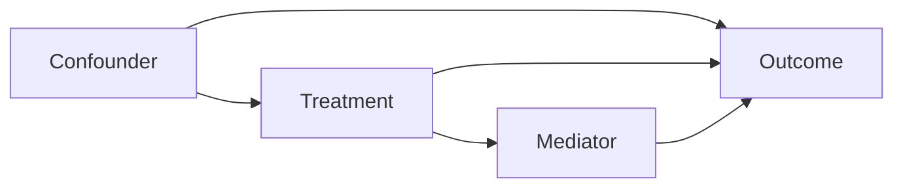

# CausalInference - Operational Causal Analysis

**Purpose:** Execute causal analyses using the framework from BookOfWhy.

> "The human provides domain knowledge (Rung 2). PLUMB handles the Rung 3 math."

---

## Architecture: Human-in-the-Middle

```
┌─────────────────────────────────────────────────────────────────┐
│                    CAUSAL ANALYSIS PIPELINE                      │
├─────────────────────────────────────────────────────────────────┤
│                                                                  │
│  HUMAN (Domain Expert)              PLUMB (Causal Engine)        │
│  ────────────────────              ─────────────────────        │
│                                                                  │
│  ┌─────────────────┐              ┌─────────────────────┐       │
│  │ Rung 2 Input    │              │ Rung 3 Operations   │       │
│  │                 │              │                     │       │
│  │ • Domain knowledge            │ • d-separation      │       │
│  │ • "X causes Y"  │──────────►  │ • Do-calculus       │       │
│  │ • Assumptions   │              │ • Identification    │       │
│  │ • What's possible│             │ • Counterfactuals   │       │
│  │ • Data sources  │              │ • PN/PS computation │       │
│  └─────────────────┘              └─────────────────────┘       │
│           │                                │                     │
│           ▼                                ▼                     │
│  ┌─────────────────────────────────────────────────────┐        │
│  │              VALIDATED CAUSAL CONCLUSIONS            │        │
│  │                                                      │        │
│  │  • Identifiable effects with confidence intervals   │        │
│  │  • Attribution with probability bounds              │        │
│  │  • Actionable recommendations                       │        │
│  └─────────────────────────────────────────────────────┘        │
│                                                                  │
└─────────────────────────────────────────────────────────────────┘
```

---

## Quick Reference

| Task | Workflow | Output |
|------|----------|--------|
| Build causal diagram | `BuildDAG` | Validated DAG (mermaid + code) |
| Check if effect estimable | `IdentifyEffect` | Yes/No + method |
| Estimate causal effect | `EstimateEffect` | Effect size + CI |
| Answer "what if X had been different?" | `CounterfactualQuery` | Probability or value |
| "Was X responsible for Y?" | `AttributionAnalysis` | PN, PS, PNS |
| Explain paradoxical finding | `ResolveParadox` | Causal explanation |
| Validate DAG against data | `ValidateDAG` | Test results |

---

## Workflows

### Core Analysis
| Workflow | Purpose |
|----------|---------|
| `BuildDAG.md` | Interactive DAG construction with domain expert |
| `ValidateDAG.md` | Test DAG implications against data |
| `IdentifyEffect.md` | Determine if effect is identifiable |
| `EstimateEffect.md` | Compute causal effect from data |

### Advanced
| Workflow | Purpose |
|----------|---------|
| `CounterfactualQuery.md` | Individual-level "what if" analysis |
| `AttributionAnalysis.md` | Compute PN/PS for responsibility |
| `MediationAnalysis.md` | Decompose direct/indirect effects |
| `SensitivityAnalysis.md` | Test robustness to assumptions |

### Integration
| Workflow | Purpose |
|----------|---------|
| `FromData.md` | Start analysis from DataAnalysis output |
| `ToReport.md` | Generate causal findings for consulting report |

---

## Tools & Libraries

### Python Stack (Primary)
```python
# Core libraries
import dowhy           # Microsoft's causal inference framework
import pgmpy           # Probabilistic graphical models
import networkx        # Graph operations
import pandas          # Data manipulation

# Estimation
from econml import *   # Microsoft's causal ML
from causalml import * # Uber's causal ML
```

### Installation
```bash
pip install dowhy pgmpy networkx econml causalml
```

### Tool Scripts
| Tool | Purpose |
|------|---------|
| `Tools/dag_builder.py` | Programmatic DAG construction |
| `Tools/identify.py` | Identification algorithms |
| `Tools/estimate.py` | Effect estimation wrappers |
| `Tools/counterfactual.py` | SCM operations |

---

## Integration with BookOfWhy

CausalInference operationalizes BookOfWhy concepts:

| BookOfWhy Concept | CausalInference Implementation |
|-------------------|-------------------------------|
| Ladder of Causation | Query classification routing |
| Causal diagrams | DAG builder with validation |
| d-separation | `pgmpy.d_separated()` |
| Backdoor criterion | `dowhy.identify_effect()` |
| Frontdoor criterion | Custom implementation |
| Do-calculus | Algorithmic application |
| SCM | `dowhy.CausalModel()` |
| PN/PS | `counterfactual.py` bounds |

### Loading Concepts

Use the context loader tool to pull in BookOfWhy conceptual frameworks:

```bash
# List available contexts
bun run Tools/LoadCausalContext.ts --list

# Load specific context
bun run Tools/LoadCausalContext.ts ladder        # Ladder of Causation
bun run Tools/LoadCausalContext.ts diagrams      # Causal Diagrams
bun run Tools/LoadCausalContext.ts do-calculus   # Do-Calculus rules
bun run Tools/LoadCausalContext.ts counterfactuals  # Counterfactual reasoning
bun run Tools/LoadCausalContext.ts traps         # Common causal traps

# Load all contexts at once
bun run Tools/LoadCausalContext.ts --all
```

---

## Example Session

```
User: "Does our training program improve employee performance?"

PLUMB: Let me help you analyze this causally.

1. CLASSIFY QUERY
   → Rung 2 (Intervention): Effect of doing training
   → Need causal diagram + identification

2. BUILD DAG (with user)
   - Training → Performance
   - Motivation → Training (selection bias)
   - Motivation → Performance (confounder)
   - Prior Skills → Performance

3. CHECK IDENTIFIABILITY
   - Backdoor path: Training ← Motivation → Performance
   - Is Motivation observed? [Ask user]
   - If yes → Backdoor adjustment
   - If no → Need instrument or bound the effect

4. ESTIMATE EFFECT
   - Method: Propensity score matching
   - ATE: 12% improvement (95% CI: 8-16%)

5. INTERPRET
   - Training causes ~12% performance improvement
   - Robust to measured confounders
   - Sensitivity analysis suggests effect persists under moderate unmeasured confounding
```

---

## DAG Specification Format

### Mermaid (Visual)


### DoWhy (Code)
```python
model = CausalModel(
    data=df,
    treatment='X',
    outcome='Y',
    graph='digraph {Z -> X; Z -> Y; X -> Y; X -> M; M -> Y}'
)
```

### Edge List (Simple)
```
Z -> X
Z -> Y
X -> Y
X -> M
M -> Y
```

---

## Templates

| Template | Purpose |
|----------|---------|
| `Templates/ConsultingDAG.md` | DAG for business consulting scenarios |
| `Templates/HealthcareDAG.md` | Common healthcare causal structures |
| `Templates/MarketingDAG.md` | Marketing attribution patterns |
| `Templates/WFM_DAG.md` | Workforce management causal models |

---

## Outputs

### Standard Report Sections
1. **Causal Question** - What we're trying to answer
2. **Assumptions** - DAG and structural assumptions
3. **Identification** - Method used and why valid
4. **Estimation** - Effect size, confidence intervals
5. **Sensitivity** - Robustness checks
6. **Interpretation** - Plain-language conclusion

### Visualization
- DAG diagram (mermaid)
- Effect plot with confidence intervals
- Sensitivity contour plot

---

## Guardrails

### Before Analysis
- [ ] Query classified to correct rung
- [ ] DAG reviewed by domain expert
- [ ] Assumptions explicitly stated
- [ ] Data quality verified

### During Analysis
- [ ] No conditioning on colliders
- [ ] No conditioning on mediators (for total effect)
- [ ] Identification method matches DAG structure
- [ ] Estimation method appropriate for data

### After Analysis
- [ ] Sensitivity analysis performed
- [ ] Limitations documented
- [ ] Causal language used appropriately
- [ ] Results reproducible
