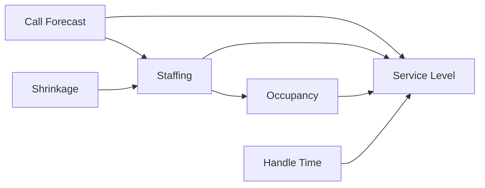
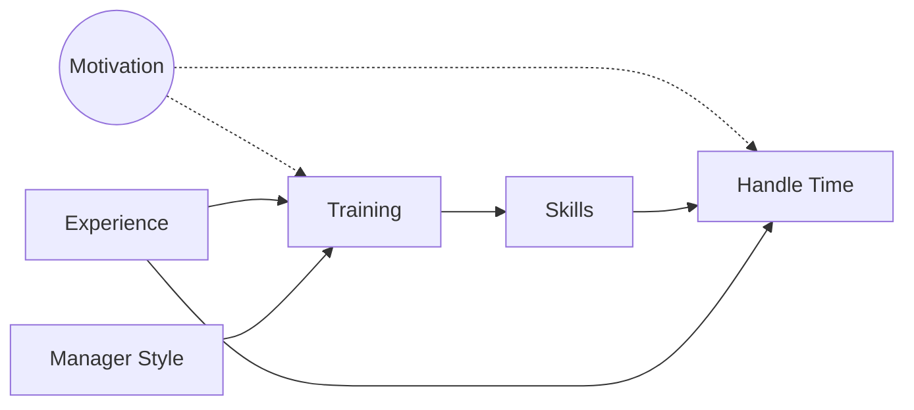
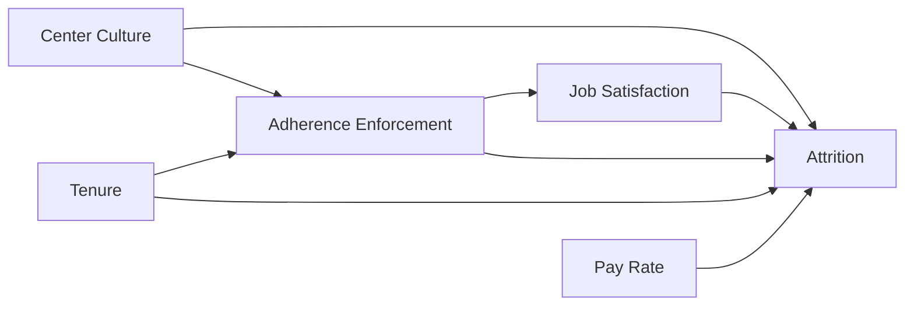
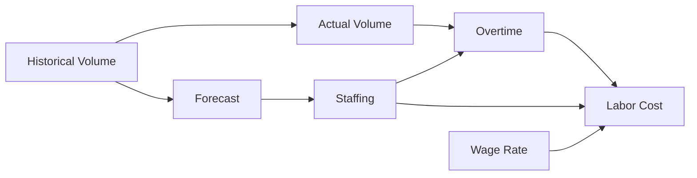
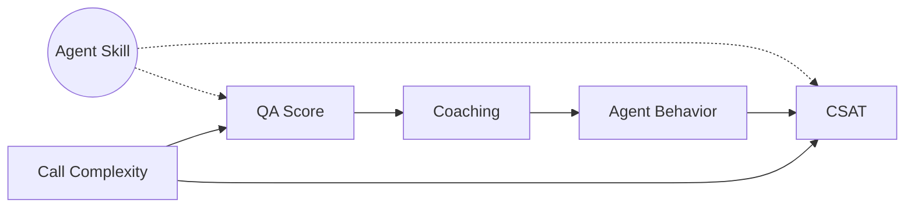
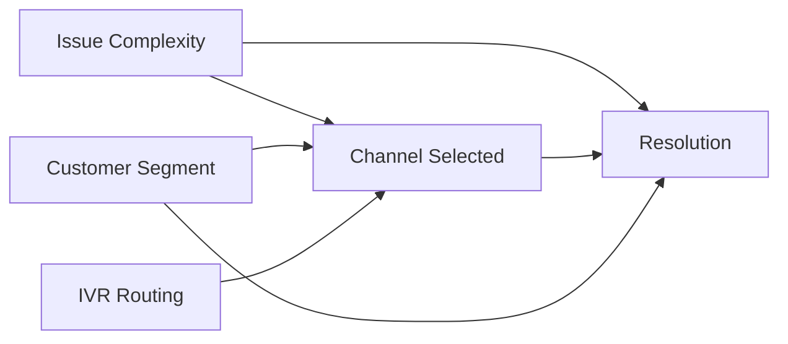

# Workforce Management Causal Templates

Common causal structures in contact center and workforce management contexts.

---

## Template 1: Staffing → Service Level

**Question:** What is the effect of staffing changes on service level?



**Variables:**
| Variable | Type | Observed |
|----------|------|----------|
| Staffing | Treatment | Yes |
| Service Level | Outcome | Yes |
| Call Forecast | Confounder | Yes |
| Occupancy | Mediator | Yes |
| Shrinkage | Confounder | Yes |
| AHT | Confounder | Yes |

**Identification:** Backdoor adjustment on {Forecast, Shrinkage, AHT}

**Typical Analysis:**
```python
# Effect of adding 1 FTE on service level
adjustment_set = ['call_forecast', 'shrinkage', 'aht']
estimate_effect(data, 'staffing_fte', 'service_level', adjustment_set)
```

---

## Template 2: Training → Performance

**Question:** Does agent training improve handle time?



**Variables:**
| Variable | Type | Observed |
|----------|------|----------|
| Training | Treatment | Yes |
| Handle Time | Outcome | Yes |
| Motivation | Confounder | No (unmeasured) |
| Skills | Mediator | Partially |
| Experience | Confounder | Yes |
| Manager Style | Instrument | Yes |

**Challenge:** Unmeasured confounder (Motivation)

**Options:**
1. Use Manager Style as instrument (if it doesn't affect performance directly)
2. Frontdoor via Skills (if Motivation doesn't affect Skills)
3. Bound the effect with sensitivity analysis

---

## Template 3: Schedule Adherence → Attrition

**Question:** Does enforcing schedule adherence increase agent attrition?



**Analysis paths:**
- **Total effect:** Don't adjust for Satisfaction (mediator)
- **Direct effect:** Adjust for Satisfaction

---

## Template 4: Forecast Accuracy → Costs

**Question:** How much does forecast accuracy affect labor costs?



**Key insight:** Forecast error (Forecast - Actual) causes both over/understaffing

---

## Template 5: Quality Monitoring → Customer Satisfaction

**Question:** Does QA feedback improve CSAT?



**Challenge:** Agent Skill confounds QA Score and CSAT

**Approach:** Use QA Score as treatment, adjust for Call Complexity, use lagged CSAT as outcome

---

## Template 6: Channel Mix → Resolution Rate

**Question:** Does pushing customers to self-service affect resolution rates?



**Key insight:** Issue Complexity confounds both Channel and Resolution — need to adjust

---

## Common Confounders in WFM

| Domain | Common Confounders |
|--------|-------------------|
| Staffing | Call volume, time of day, day of week |
| Training | Agent motivation, tenure, prior experience |
| Quality | Agent skill, call complexity, customer segment |
| Scheduling | Site culture, union rules, manager preferences |
| Attrition | Labor market conditions, pay competitiveness |

---

## Common Mediators in WFM

| Treatment | Mediator | Outcome |
|-----------|----------|---------|
| Training | Skills/Knowledge | Handle Time |
| Staffing | Queue Wait Time | Abandonment |
| Coaching | Agent Confidence | Quality Score |
| Schedule Flexibility | Job Satisfaction | Attrition |
| Technology Investment | Process Efficiency | Cost per Contact |

---

## Typical WFM Questions by Rung

### Rung 1 (Association)
- "What's the correlation between staffing and service level?"
- "Which agents have the best handle times?"

### Rung 2 (Intervention)
- "What would happen if we added 10 FTEs?"
- "How would service level change if we reduced AHT by 30 seconds?"
- "What's the ROI of the new training program?"

### Rung 3 (Counterfactual)
- "Would service level have been acceptable if we hadn't had the system outage?"
- "Would this agent have quit if we'd promoted them?"
- "Was the new IVR responsible for the drop in CSAT?"

---

## Data Requirements

| Analysis Type | Minimum Data |
|--------------|--------------|
| Staffing impact | Interval-level staffing, volume, SL by day/interval |
| Training ROI | Pre/post metrics, control group if possible |
| Attrition drivers | Agent-level tenure, performance, exit surveys |
| Quality-CSAT link | Call-level QA scores + customer surveys |

---

## Quick Reference: When to Adjust

| Variable | Adjust for Total Effect? | Why? |
|----------|-------------------------|------|
| Call Volume | Yes | Confounder of staffing-SL |
| Handle Time | Usually yes | Confounder |
| Queue Time | No | Mediator of staffing-SL |
| Agent Satisfaction | No | Mediator of many effects |
| Prior Performance | Sometimes | May be confounder or mediator |
| Tenure | Yes | Almost always a confounder |
