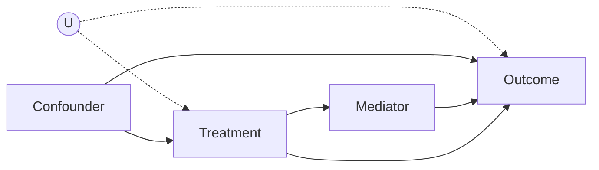

# BuildDAG Workflow

Interactive construction of a causal diagram with domain expert input.

---

## Purpose

Transform domain knowledge into a validated causal diagram that can be used for identification and estimation.

---

## Input
- Causal question (treatment, outcome)
- Domain expert available for questions
- Optional: existing data with variable list

## Output
- Validated DAG in multiple formats (mermaid, DoWhy, edge list)
- Variable classification (treatment, outcome, confounders, mediators, colliders)
- Identified adjustment sets
- Testable implications

---

## Procedure

### Phase 1: Scope the Question

**Ask the user:**
1. What is the treatment/intervention? (X)
2. What is the outcome of interest? (Y)
3. Is this about average effect or individual attribution?

**Classify:**
- Rung 2 → Proceed with intervention analysis
- Rung 3 → Will need SCM, note for later

### Phase 2: Enumerate Variables

**Prompt the user:**
```
Let's list all variables that might be relevant. Consider:

1. CONFOUNDERS - Things that affect BOTH {treatment} and {outcome}
   Example: "Motivation affects both training enrollment and performance"

2. MEDIATORS - Things through which {treatment} affects {outcome}
   Example: "Training affects skills, skills affect performance"

3. INSTRUMENTS - Things that affect {treatment} but not {outcome} directly
   Example: "Distance to training center affects enrollment"

4. OUTCOMES - Other effects of {treatment} we should consider
   Example: "Training also affects job satisfaction"

What variables should we include?
```

**Record each variable with:**
- Name
- Observed/Unobserved
- Brief description

### Phase 3: Establish Relationships

**For each pair of variables, ask:**
```
Does {A} directly cause {B}? (not through another variable)
- Yes → Draw arrow A → B
- No → No arrow
- Uncertain → Mark as "possible edge" for sensitivity analysis
```

**Key questions to ask:**
1. "If we could magically change {A}, would {B} change?"
2. "Is there any mechanism by which {A} directly affects {B}?"
3. "Could there be a common cause of {A} and {B} we haven't listed?"

### Phase 4: Identify Hidden Confounders

**Prompt:**
```
Are there any UNMEASURED variables that might affect both {treatment} and {outcome}?

Common unmeasured confounders:
- Motivation/ability (affects behavior and outcomes)
- Socioeconomic status (affects many things)
- Health status (in medical studies)
- Time trends (affects variables measured at different times)
```

**For each unmeasured confounder:**
- Add to DAG with (U) notation
- Document assumption that it's unmeasured

### Phase 5: Classify Structure

**For each variable, classify:**

| Variable | Role | Reason |
|----------|------|--------|
| X | Treatment | User specified |
| Y | Outcome | User specified |
| Z₁ | Confounder | Causes both X and Y |
| M | Mediator | On path X → M → Y |
| C | Collider | Common effect |
| I | Instrument | Affects X only |

### Phase 6: Generate DAG Formats

**Mermaid format:**


**DoWhy format:**
```python
graph = """
digraph {
    U [observed="no"];
    U -> X;
    U -> Y;
    Z -> X;
    Z -> Y;
    X -> M;
    M -> Y;
    X -> Y;
}
"""
```

**Edge list:**
```
U -> X [unobserved]
U -> Y [unobserved]
Z -> X
Z -> Y
X -> M
M -> Y
X -> Y
```

### Phase 7: Validate DAG

**Check for issues:**

1. **Cycles:** DAG must be acyclic
   ```python
   import networkx as nx
   assert nx.is_directed_acyclic_graph(G)
   ```

2. **Missing confounders:** For each X-Y pair without arrow, ask "Could there be a common cause?"

3. **Collider traps:** Identify any colliders that might be conditioned on

4. **Mediator confusion:** Ensure mediators aren't treated as confounders

### Phase 8: Extract Testable Implications

**Generate d-separation statements:**
```
If the DAG is correct, these independencies should hold:

1. A ⊥ B | C
2. D ⊥ E | F, G
...

These can be tested against data to validate the DAG.
```

### Phase 9: Identify Adjustment Sets

**For P(Y|do(X)), find:**

1. **Backdoor adjustment sets:**
   - List all valid adjustment sets
   - Note minimal sufficient set

2. **Frontdoor path (if backdoor blocked):**
   - Check for shielded mediator

3. **Instrumental variables:**
   - List valid instruments

---

## Example Session

```
PLUMB: What causal question are you trying to answer?

User: Does our training program improve employee retention?

PLUMB: Got it. Let's build the causal diagram.
- Treatment (X): Training program participation
- Outcome (Y): Employee retention (stayed 1+ year)

What variables might affect BOTH training participation AND retention?

User: Employee engagement probably affects both. Also tenure - newer employees are more likely to take training and less likely to stay.

PLUMB: Good. Let me add those as confounders:
- Engagement → Training
- Engagement → Retention
- Tenure → Training
- Tenure → Retention

Anything that training affects that in turn affects retention?

User: Skills gained from training, definitely. Also maybe job satisfaction.

PLUMB: Adding mediators:
- Training → Skills → Retention
- Training → Satisfaction → Retention

Is there anything that affects training participation but NOT retention directly?

User: The manager's encouragement to take training. Some managers push it more than others.

PLUMB: Good instrument! Adding:
- Manager Encouragement → Training (but no arrow to Retention)

Any unmeasured confounders we should worry about?

User: Probably underlying ability/motivation that we can't measure well.

PLUMB: Adding unmeasured confounder:
- U (ability/motivation) → Training
- U → Retention

Here's the DAG:

[Generates mermaid diagram]

Checking structure:
- Engagement, Tenure: Confounders (observed) ✓
- Skills, Satisfaction: Mediators ✓
- Manager Encouragement: Instrument ✓
- U: Unmeasured confounder ⚠️

Because U is unmeasured, we cannot use simple backdoor adjustment.
Options:
1. Use Manager Encouragement as instrumental variable
2. Use Skills as frontdoor (if U doesn't affect Skills)
3. Bound the effect under unmeasured confounding

Which approach would you like to explore?
```

---

## Output Template

```markdown
# Causal Diagram: {Question}

## Variables
| Name | Type | Observed | Description |
|------|------|----------|-------------|
| X | Treatment | Yes | ... |
| Y | Outcome | Yes | ... |
| ... | ... | ... | ... |

## DAG
[mermaid diagram]

## Assumptions
1. No direct edge from A to B (assumed no direct effect)
2. U is unmeasured
3. ...

## Identification Strategy
- Method: {backdoor/frontdoor/IV}
- Adjustment set: {Z1, Z2}
- Validity conditions: ...

## Testable Implications
1. A ⊥ B | C (test in data)
2. ...

## Limitations
- Assumes no unmeasured X-Y confounder beyond U
- ...
```
